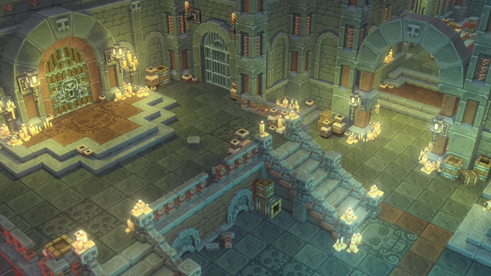
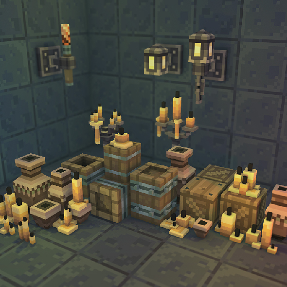
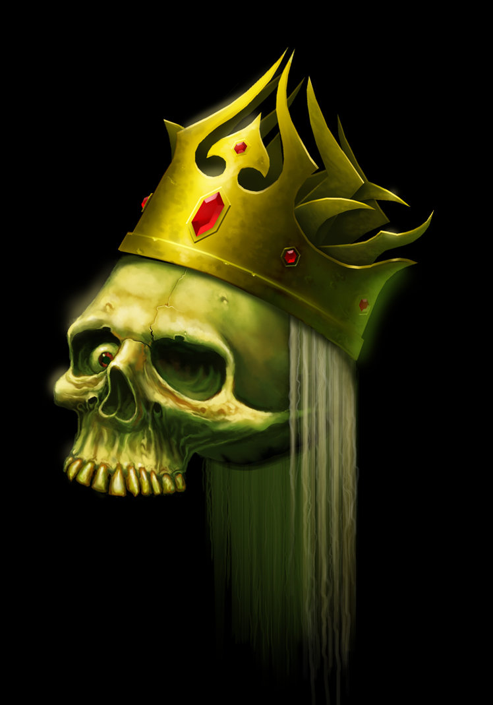
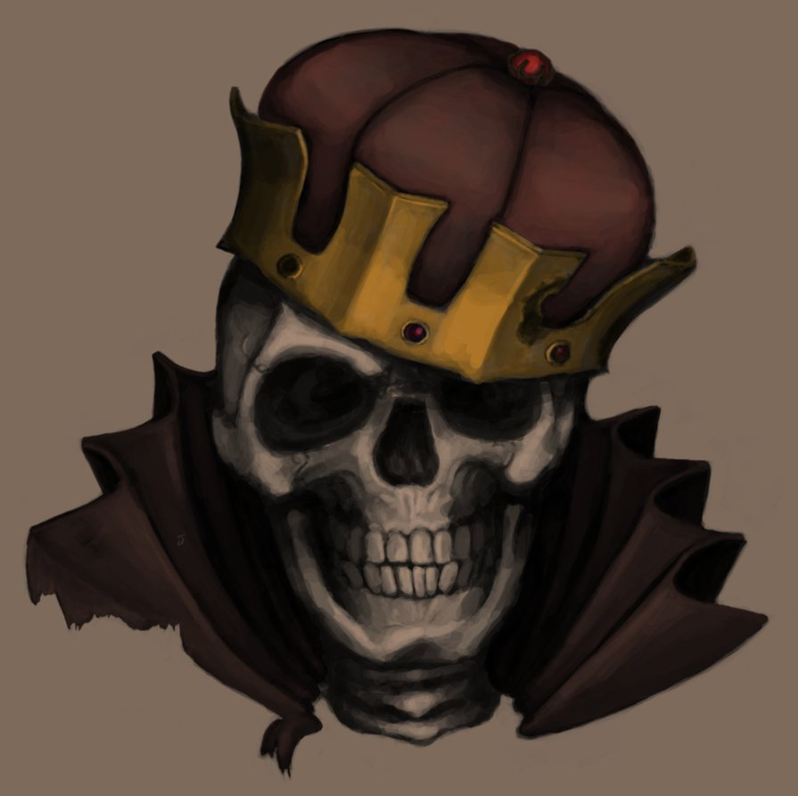
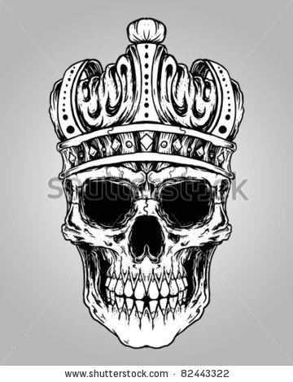
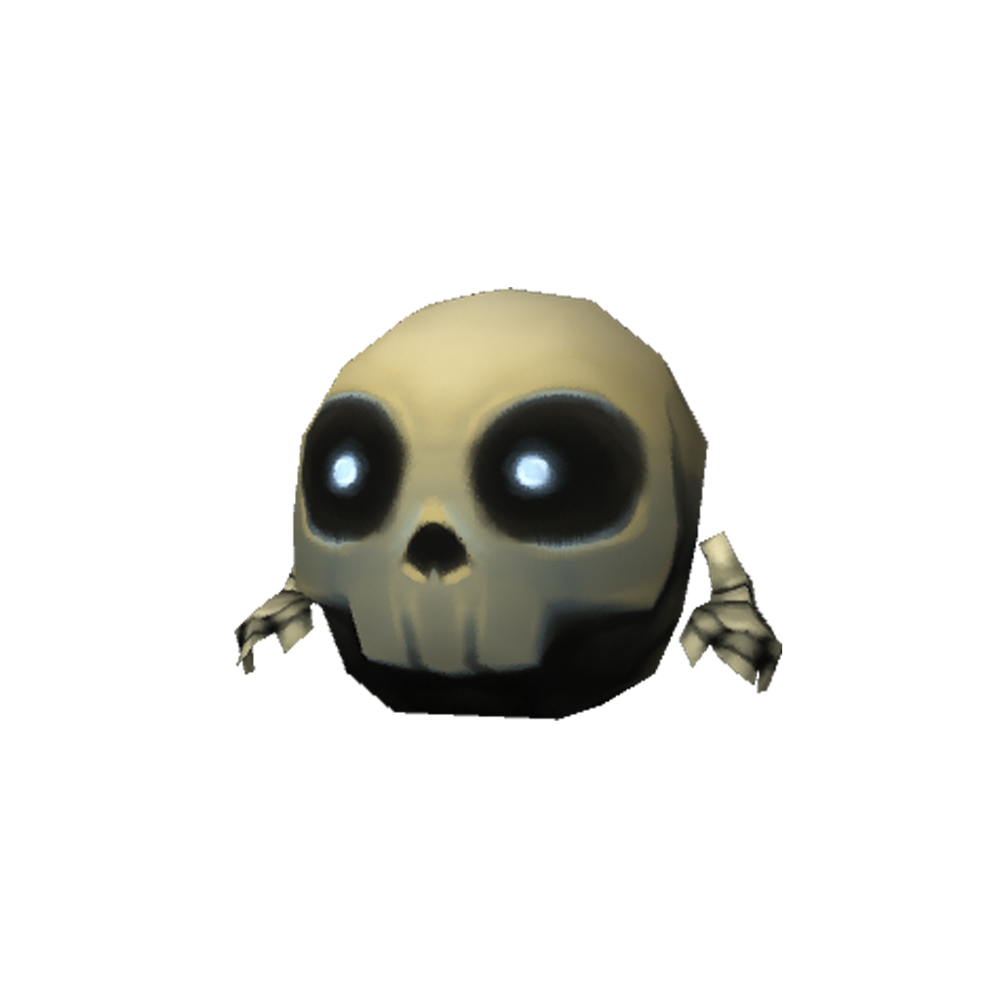
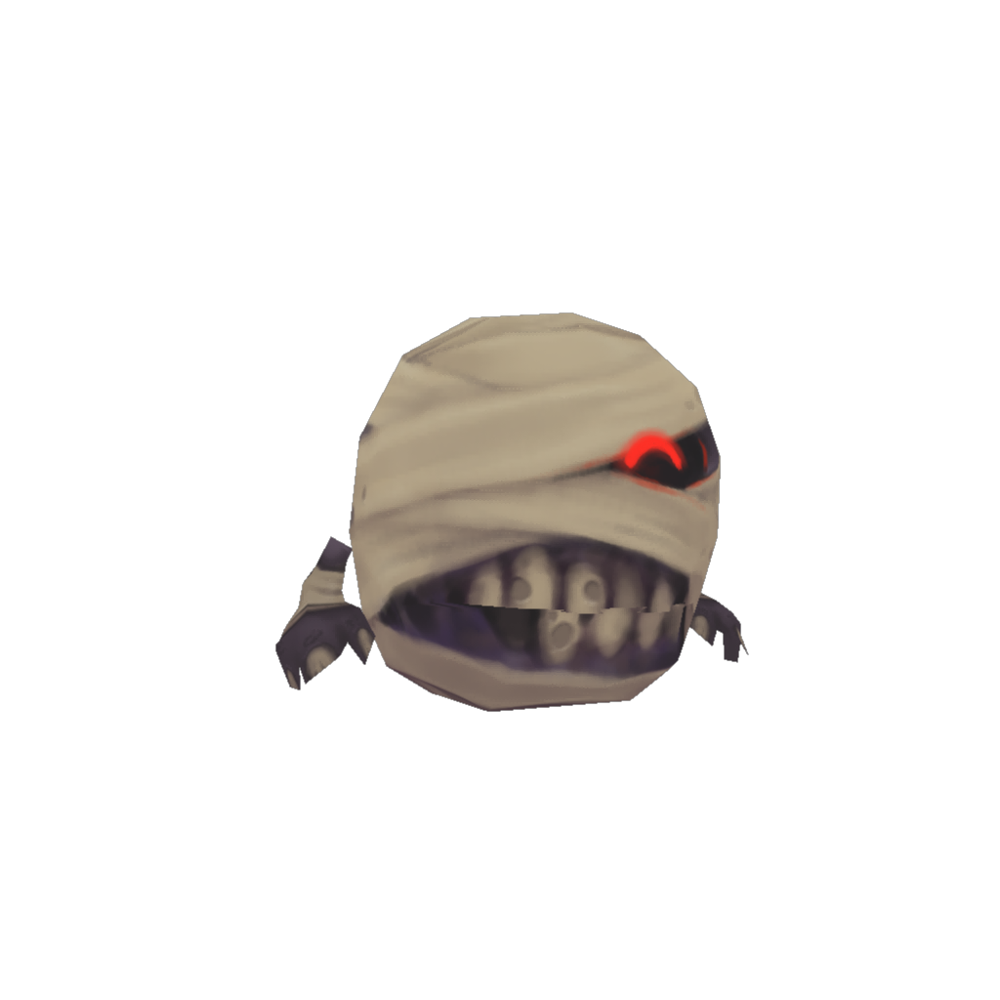
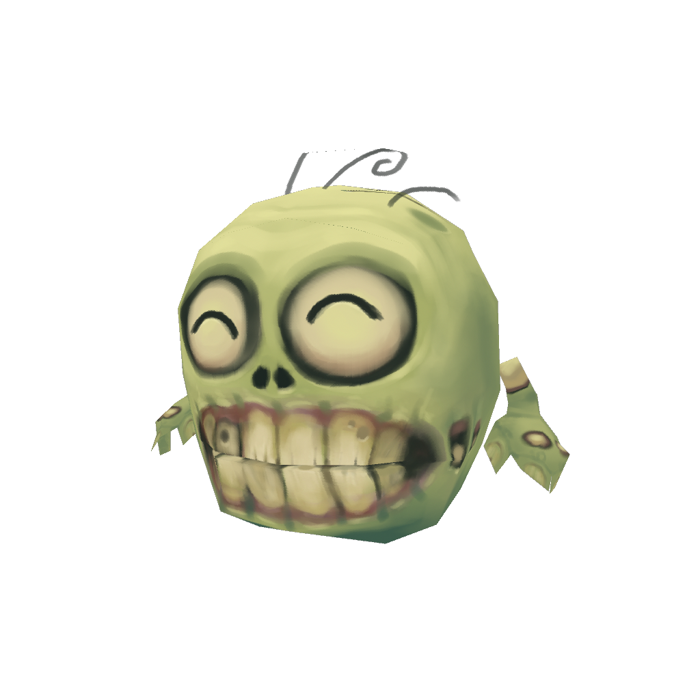

# Art Style

## Level Style

The baseline art style is Bitgem’s Low-poly style:

## Units Style

### Inspirational Concept Art

### Unit Models

#### Young Skull

#### Mummy Skull

#### Ghoul Skull

#### Ghost Skull

