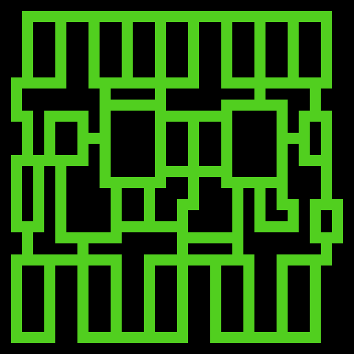

# Game Level

Game level are single-floored, i.e. no use of stairways or ladders.

Units will strictly move along two axes on a flat plane. All gameplay takes place on a flat plane with no changes in elevation on the walkable paths

## Example Complete Level Design

Each green square constitutes 1 walkable tile.

## Game Grid
- A typical map is 32x32 units.
- The player can interact with each 1x1 unit on the map.
- Every tile, unit and power in the game occupies a single 1x1 unit.
- Multiple units may occupy the same tile. (Need overlap rule)