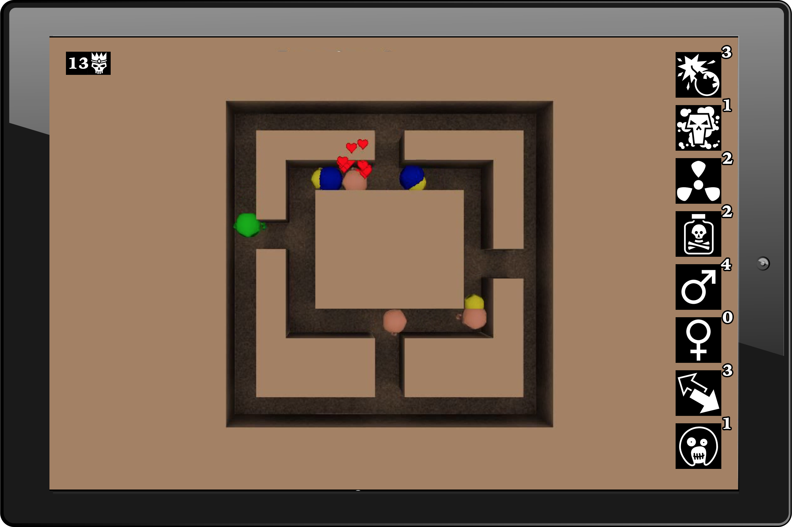

# UX

## Orientation

The game is only played horizontally (see stretch goals for exception). This enables easy cross-platform development between PC and Mobile.

## Zoom

(PC should never really require zooming nor screen drag because of plenty screen real-estate)

Default zoom is 24x24 tiles.

## Camera Angle
The game is always played from a top-down isometric perspective. This never changes. No tilting option is necessary.

## Start Menu
The menu is a dead simple “play / settings / exit”.

- Play → Initiates the game (there is only one level)
- Settings → Music volume, SFX volume
- Exit → Terminate game.

## In-game Menu
The play screen is split up into two parts. On the left is the 32x32 game map, and the remaining space on the right is occupied by the in-game menu. From here the player selects which powers to use.

The in-game menu contains:
- 8 types of powerups
- A Skull population-meter (optionally including Skull type)
- A map (optional)

## End-game menu

At the end of a game the player will be presented with a score.

Scoring mechanic:
- Base 600 points.
- 1 point subtracted every second.
- 10 points per Skull kill. (5 points per kill by ~~Mutated Skull~~ Ghost if true to original).

## Effects

Every activation of a power, and every status change must result in visual or auditory feedback (or both), so they players feel that they have an impact. 